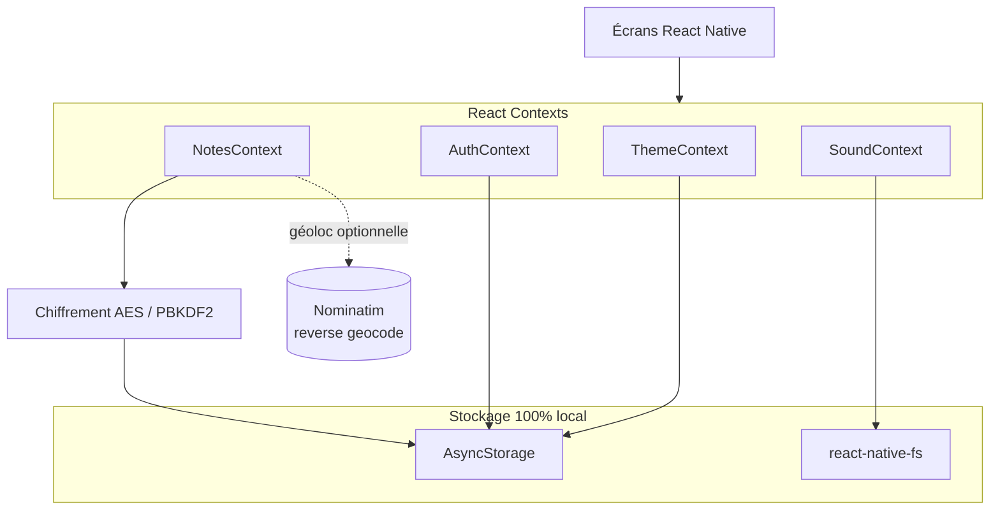

# Mes Pensées

> Votre journal intime, chiffré et 100 % local.

    

**Mes Pensées** est une application mobile de journal intime pensée pour la
confidentialité absolue : **aucun cloud, aucun backend, aucun compte**. Tout
reste sur votre appareil. Les notes sont chiffrées au repos, l'accès est
protégé par un code PIN et/ou la biométrie, et plusieurs garde-fous protègent
votre vie privée en cas d'accès non autorisé.

L'interface est entièrement en **français**.

---

## Présentation

Mes Pensées vous permet d'écrire vos pensées au quotidien dans un espace
sécurisé. Migrée d'Expo vers **React Native CLI (bare)**, l'application est
écrite en **JavaScript pur** (pas de TypeScript), utilise **Hermes** et la
**New Architecture**. La plateforme mature est **Android** (APK directement
buildable) ; iOS existe à l'état de **squelette**.

Identifiant d'application : `com.mespensees.app`

---

## Site vitrine (`website/`)

Le site Next.js officiel est intégré dans ce monorepo sous `website/`. Il fait
partie du code à publier : pages, composants, traductions, images publiques et
configuration Next/Vercel.

```bash
cd website
npm install
npm run dev
npm run build
npm run lint
```

Pour Vercel, configurer le projet avec `Root Directory = website`, framework
**Next.js**, build command `npm run build`, install command `npm install` et
output directory par défaut.

Les dossiers générés (`website/.next/`, `website/out/`, caches, logs) restent
locaux et ne doivent pas être versionnés.

---

## Fonctionnalités

### Écriture
- Éditeur de notes riche avec dates et géolocalisation optionnelle.
- Modèles d'écriture / amorces (writing templates).
- Notes vocales (enregistrement audio) et dictée vocale (speech-to-text).
- Géolocalisation des notes avec reverse geocoding via **Nominatim**.

### Sécurité & confidentialité
- Chiffrement **AES** des notes (crypto-js) avec clé dérivée par **PBKDF2**.
- Code **PIN haché** (PBKDF2 + sel) — jamais stocké en clair.
- **Biométrie** (empreinte / Face ID) via `react-native-biometrics`.
- **Mode leurre** : un PIN factice ouvre un journal fictif.
- **Auto-destruction** des données après 3 échecs de saisie du PIN.
- **Mode incognito** (session sans trace persistante).
- **Auto-verrouillage** automatique.
- **Alerte intrusion** : prise de photo discrète via `react-native-vision-camera`.
- **Récupération du PIN** par mots-clés secrets.

### Organisation
- **Timeline** chronologique des pensées.
- **Recherche** dans les notes.
- **Statistiques** d'écriture.
- **Capsules temporelles** (notes à ouvrir plus tard).
- **Corbeille** avec rétention de 30 jours.
- **Coffre** dédié.

### Médias
- Pièces jointes images (`react-native-image-picker`).
- Audio (notes vocales) via `react-native-audio-recorder-player`.
- **Export PDF / TXT** (`react-native-html-to-pdf`) et partage natif (`react-native-share`).

### Personnalisation
- Thèmes clair / sombre / système.
- **Ambiances sonores** (pluie, forêt, café, feu) en lecture en boucle.
- Notifications locales / rappels (`@notifee/react-native`).

### Widgets
- **Widgets Android natifs** (Kotlin) pour l'écran d'accueil — voir `WIDGET.md`.
- iOS : non livré (nécessite une Widget Extension et un Mac).

### Widgets Android et confidentialité

Le code source des widgets Android doit bien être versionné : il s'agit d'une
fonctionnalité native de l'application (`android/app/src/main/java/.../widget/`,
layouts XML et déclarations Manifest), pas d'un artefact personnel ou généré.

Les widgets actuels sont :

- **Inspiration du jour** : affiche une invitation d'écriture générique codée en
  dur côté natif.
- **Série d'écriture** : affiche uniquement le nombre de jours consécutifs
  d'écriture (`streak`).
- **Raccourcis** : ouvre des écrans de l'app via deep links, sans afficher de
  donnée.

Règle de confidentialité : un widget ne doit jamais afficher ni stocker de titre,
de contenu de note, de capsule, de donnée de coffre ou de donnée utilisateur
sensible. L'ancien risque de fuite de titre a été corrigé : le pont natif ne
persiste que la série d'écriture et ignore tout titre/contenu éventuel.

> ℹ️ Les fonctionnalités ci-dessus reflètent l'état réel du code. Sur iOS, seul
> le squelette du projet existe : certaines briques natives doivent encore être
> configurées (voir [Notes iOS](#notes-ios)).

---

## Stack technique

| Domaine | Technologie |
| --- | --- |
| Framework | React Native 0.83.2 (CLI bare), React 19.2.0 |
| Moteur JS | Hermes + New Architecture |
| Langage | JavaScript (pas de TypeScript) |
| Navigation | `@react-navigation/native` + `native-stack` |
| Stockage | `@react-native-async-storage/async-storage` + `react-native-fs` |
| Chiffrement | `crypto-js` (AES, PBKDF2) + `react-native-get-random-values` |
| Biométrie | `react-native-biometrics` |
| Caméra | `react-native-vision-camera` |
| Audio | `react-native-audio-recorder-player` |
| Dictée vocale | `@react-native-voice/voice` |
| Notifications | `@notifee/react-native` |
| Géolocalisation | `react-native-geolocation-service` + Nominatim |
| PDF / Partage | `react-native-html-to-pdf`, `react-native-share` |
| Images / Capture | `react-native-image-picker`, `react-native-view-shot` |
| UI | `react-native-svg`, `react-native-safe-area-context`, `react-native-screens`, `@react-native-community/slider` |
| Infos appareil | `react-native-device-info` |

---

## Architecture

L'application est **autonome et locale** : pas de serveur, pas d'API distante
(hormis Nominatim pour le reverse geocoding optionnel). L'état global repose sur
**4 React Contexts** et la persistance sur **AsyncStorage** + le système de
fichiers (`react-native-fs`).

| Context | Rôle |
| --- | --- |
| `ThemeContext` | Thème, mode clair/sombre, premier lancement |
| `AuthContext` | PIN, biométrie, mode leurre, verrouillage, auto-destruction |
| `NotesContext` | Notes, chiffrement/déchiffrement, corbeille, capsules |
| `SoundContext` | Ambiances sonores et volume |



Le chiffrement, le hachage du PIN et la dérivation de clé sont implémentés dans
`utils/encryption.js`. **Aucune donnée ne quitte l'appareil.**

---

## Prérequis

- **Node.js ≥ 18**
- **JDK 17** (Android)
- **Android Studio** + Android SDK
- Pour iOS : **macOS**, Xcode 15+ et CocoaPods (`gem install cocoapods`)

---

## Installation

```bash
cd MesPensees
npm install
```

> Un script `postinstall` applique automatiquement un patch natif pour le module
> de dictée vocale (`scripts/patch-voice-android.js`).

---

## Lancement en développement

Terminal 1 — démarrer le bundler Metro :

```bash
npm start
```

Terminal 2 — compiler et installer sur un appareil / émulateur Android :

```bash
npm run android
```

> Sur macOS, pour iOS : `npm run ios` (voir [Notes iOS](#notes-ios)).

Commandes utiles :

```bash
npm test
npm run lint
npm run android
```

---

## Build APK release

Pour produire un APK autonome (qui fonctionne sans PC ni Metro) :

```bash
npm run android:apk
```

Ce script (`scripts/build-apk.ps1`) nettoie le cache Gradle, synchronise les
icônes et les sons, puis lance `gradlew assembleRelease`. L'APK généré se trouve
ici :

```
android/app/build/outputs/apk/release/app-release.apk
```

Installation via ADB :

```bash
adb install -r android/app/build/outputs/apk/release/app-release.apk
```

> ⚠️ **Avertissement signature** — La variante *release* est actuellement signée
> avec le **keystore de debug** (`android/app/debug.keystore`, voir
> `signingConfig signingConfigs.debug` dans `android/app/build.gradle`). C'est
> pratique pour tester, mais **inacceptable pour une publication réelle**. Avant
> toute distribution (Play Store ou autre), **générez un vrai keystore** et
> configurez une `signingConfig release` dédiée. Voir la
> [documentation officielle](https://reactnative.dev/docs/signed-apk-android).

Pour un build debug (nécessite Metro lancé sur le PC) :

```bash
npm run android:apk:dev
```

Les APK/AAB générés (`*.apk`, `*.aab`) sont des artefacts de distribution. Ils ne
doivent pas être commités par défaut ; publier un binaire doit être une décision
explicite (par exemple via une release ou un espace de téléchargement séparé).

---

## Structure du projet

```
MesPensees/
├── App.js                 # Navigation + arborescence des Providers
├── index.js               # Point d'entrée (AppRegistry)
├── app.json               # name / displayName
├── screens/               # 15 écrans (Onboarding, Lock, Pin, Timeline, Editor…)
├── context/               # 4 Contexts (Theme, Auth, Notes, Sound)
├── utils/                 # encryption, location, exportPDF, ambiancePlayer, widgetBridge…
├── components/            # Composants partagés (ex. IntrusionCamera)
├── assets/                # Polices, sons d'ambiance, images
├── scripts/               # build-apk.ps1, sync-android-*.ps1, patch-voice-android.js
├── android/               # Projet Android natif (Kotlin, widgets)
├── ios/                   # Projet iOS (squelette)
├── MIGRATION.md           # Notes de migration Expo → RN CLI
└── WIDGET.md              # Documentation des widgets Android
```

Écrans : Onboarding, Lock, Pin, Timeline, Editor, Stats, Coffre,
Personnalisation, Drawer, Search, Notifications, ShareNote, Capsules, Trash,
Recovery.

---

## Sécurité

Quelques précisions honnêtes sur le modèle de sécurité :

- **Chiffrement local au repos, pas de chiffrement réseau de bout en bout (E2E).**
  Comme l'application n'a **aucun backend**, il n'y a pas de transmission de
  données à chiffrer en transit. Le chiffrement protège les **données stockées
  sur l'appareil**, pas un échange réseau.
- **Notes chiffrées en AES** (crypto-js). La clé est dérivée du PIN via PBKDF2
  puis conservée localement.
- **PIN haché** avec PBKDF2 + sel aléatoire (10 000 itérations) — jamais stocké
  en clair (`utils/encryption.js`).
- **Mode leurre** : un PIN secondaire ouvre un journal factice, sans révéler le
  vrai contenu.
- **Auto-destruction** des données après 3 tentatives de PIN incorrectes.
- **Biométrie** (empreinte / Face ID) comme déverrouillage rapide.
- **Alerte intrusion** : capture photo discrète lors d'une tentative d'accès.

> Le niveau de protection dépend aussi de la robustesse du PIN choisi et de la
> sécurité globale de l'appareil. Aucune solution logicielle ne remplace un
> appareil verrouillé et à jour.

---

## Ce qui n'est pas versionné

Ces fichiers restent locaux et ne doivent pas être poussés :

- Keystores, clés de signature, certificats, secrets et fichiers `.env*`.
- `android/app/debug.keystore`, `android/local.properties`, chemins SDK locaux.
- Logs (`android-build*.log`, `*.log`), crash dumps et caches.
- Artefacts générés : `android/app/build/`, `android/build/`, `.gradle/`,
  `.next/`, `website/.next/`, `coverage/`, APK/AAB.
- Fichiers IDE/personnels : `.idea/`, `android/.idea/`, `.vscode/`, `*.iml`.
- Données utilisateur, exports personnels, captures privées ou contenu de notes.
- Instructions locales d'agents (`CLAUDE.md`, `AGENTS.md`) si elles ne documentent
  pas le projet public.

---

## Notes iOS

iOS est au stade **squelette** :

- Le dossier `ios/` doit être généré/complété sur un **Mac**.
- Après `npm install`, exécutez `cd ios && pod install` (CocoaPods requis).
- Les permissions (`Info.plist`) et certains modules natifs doivent être
  vérifiés (voir `MIGRATION.md`).
- Le **widget iOS** n'est pas livré (Widget Extension Swift à créer).

Sans Mac, il est possible de passer par une CI macOS (GitHub Actions, Codemagic).

---

## Licence

Aucune licence n'est définie pour le moment. _À compléter_ (ex. MIT, propriétaire…)
en ajoutant un fichier `LICENSE` à la racine.
